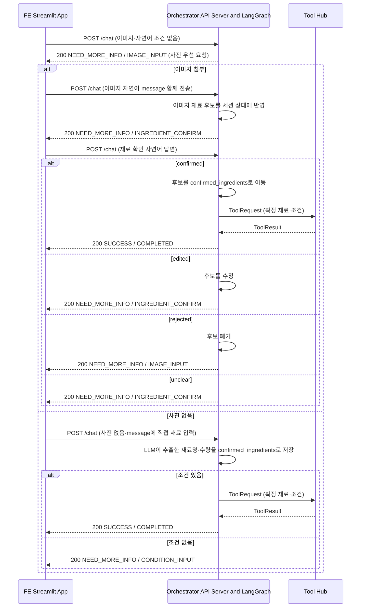
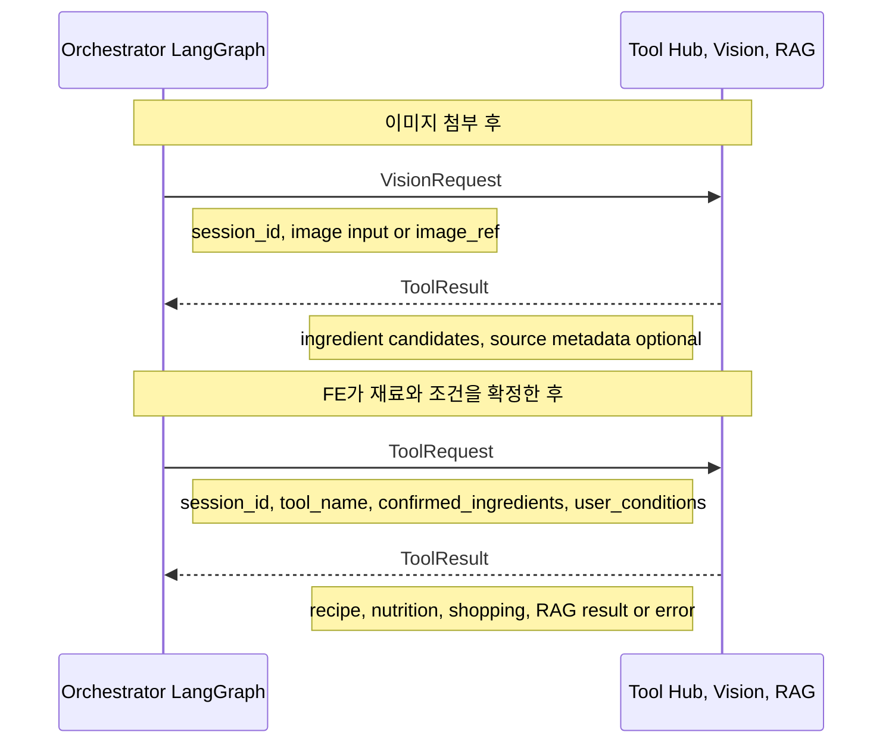
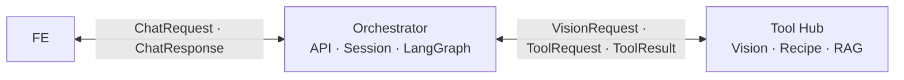

# PlanEat 데이터 흐름

## 역할과 경계

| 역할 | 담당자 | 책임 |
|---|---|---|
| FE | 이홍진 | Streamlit 화면, 사용자 입력 수집, `/chat` 응답 상태별 화면 전환 |
| Orchestrator | 최경락 | API Server, LangGraph Orchestrator, 세션 상태 관리, 워크플로우 분기 |
| Tool Hub | 박동준 | Tool Hub, RAG 검색, 도구 실행 결과 반환 |

`POST /chat`의 외부 계약은 [Chat API 명세](../api/chat.md)를 따릅니다. 완료 단계의 Orchestrator↔Tool Hub
호출은 LangGraph의 `tool_hub_recipe_recommendation` Tool node와 로컬 CSV·선택적 Chroma adapter를
통해 실행되며, 외부 Tool Hub 네트워크 endpoint는 아직 사용하지 않습니다.

## 1. 외부 대화 흐름: FE ↔ Orchestrator

FE는 `POST /chat`만 호출하고, `status`와 `step`으로 다음 화면을 결정한다. Orchestrator는 HTTP API,
세션 상태, LangGraph 전이와 응답 DTO 변환을 담당한다.

입력 형식 오류·안전성 검사 실패는 `400 ERROR`, 처리 실패는 `500 ERROR`로 반환한다. `ERROR`에는
`step`이 없다. 재료가 없는 요청은 Orchestrator가 `IMAGE_INPUT`으로 사진 또는 자연어 재료 입력을
안내한다. FE는 별도 조건 JSON이 아닌 `message`에 식단 목적과 선택 조리 시간을 적어 보낸다. 재료가
자연어로 포함된 첫 요청은 이미지 단계를 건너뛰고, 재료와 목적이 모두 있으면 바로 추천으로 진행한다.
한쪽만 있으면 기존 `IMAGE_INPUT` 또는 `CONDITION_INPUT`을 반환한다. Orchestrator는 이미지를
직접 인식하지 않으며, 2절의 Tool Hub Vision 결과를 `INGREDIENT_CONFIRM` 응답으로 변환한다.
사용자가 `message`에 직접 입력한 지원 재료는 첫 요청인지와 관계없이 사용자 확정 입력으로 처리해
이미지 단계를 우회할 수 있다. 수량이 없으면 `수량 미정`으로 보정한다. 조건이 부족하면
`CONDITION_INPUT`만 반환한 뒤, 조건 입력 후 동일한 추천 흐름으로 이어진다.

추천 완료 후에는 최종 결과를 먼저 반환한다. 후속 `message`가 피드백이면 Jev Plan을 거쳐
조건을 갱신하고 재추천·재검증하며, 세트 선택이면 선택 세트 상세 PDF를 저장한 뒤 `pdf_url`을 반환한다.

`INPUT_REQUIREMENTS`, `IMAGE_INPUT`, `CONDITION_INPUT`의 `response`·`questions`는 마지막
사용자 메시지와 세션 상태를 입력으로 하는 OpenAI Structured Outputs 결과다. 따라서
`냉장고 사진은 없는데`처럼 이미지가 없다는 의사만 전달된 경우에도 이미지 첨부를 반복하는
대신 자연어 재료 입력을 안내할 수 있다. 이 LLM 호출이 실패하거나 안전성 검증을 통과하지
못하면 단계별 고정 fallback을 사용하고, `status`·`step` 전이는 변경하지 않는다.

## 2. 내부 도구 흐름: Orchestrator ↔ Tool Hub

Orchestrator는 사용자에게 확인받기 전의 재료 후보를 추천·RAG 입력으로 보내지 않는다. 사용자가
`confirmed`로 답한 뒤에만 `confirmed_ingredients`를 ToolRequest에 넣는다. Tool Hub는 Vision과
Vision 후보 또는 Tool 실행 결과만 반환하며, FE용 JSON으로 바꾸는 책임은 Orchestrator에 있다.

단, 이미지가 아닌 `message`로 사용자가 직접 적은 재료는 이미지 인식 후보가 아니므로 별도
확인 없이 `confirmed_ingredients`로 취급한다. 현재 `/chat`의 이미지·자연어 재료 추출은
OpenAI 구조화 추출기를 사용하고, 확정 이후의 추천·영양·장보기·RAG는 Tool Hub가 담당한다.

### 대화 요약 전이

LangGraph State는 사용자·어시스턴트 메시지를 세션별로 보관한다. 메시지가 10개를 초과하면
`summarize_conversation` 노드가 오래된 메시지를 결정적으로 요약하고 최근 2개만 남긴 뒤
기존 `route_chat` 노드로 전이한다. 현재 Orchestrator는 외부 LLM을 기본 테스트에 연결하지 않기 위해
로컬 요약을 사용하며, 실제 요약 모델은 해당 노드의 교체 지점으로 연결할 수 있다.

### Orchestrator → Tool Hub 전달 원칙

| 항목 | 용도 |
|---|---|
| `session_id` | 도구 호출을 현재 대화와 연결 |
| `tool_name` | Orchestrator가 실행할 도구 선택 |
| `confirmed_ingredients` | 사용자 확인을 마친 재료만 전달 |
| `user_conditions` | 여러 턴에 걸쳐 누적된 식단 목적과 선택 조리 시간 전달 |

### 사용자 재료 확인 판정

Orchestrator는 재료 확인 단계에서 Jev Choice 질문으로 `confirmed`, `rejected`, `edited`, `unclear`를
분류한다. Jev가 비활성화되거나 실패하면 제한적인 로컬 자연어 fallback을 사용한다. `edited`의
추가·삭제·수량 변경과 복잡한 식재료 추출은 모두 LLM 구조화 결과로 반영하고, Tool Hub Vision·재료
정규화 DTO가 합의되면 해당 어댑터로 교체한다.

### Vision Function Call 입력 계약

이미지 인식은 재료가 확정되기 전 단계이므로, 일반 추천 ToolRequest와 구분한다. Orchestrator는 이미지가
첨부됐을 때 Tool Hub Vision Function Call에 `session_id`와 이미지 입력을 전달하고, Tool Hub는 재료 후보만
반환한다. 후보는 FE의 확인 전 추천·RAG 입력으로 사용할 수 없다.

Vision 전용 endpoint와 상세 DTO는 아직 외부 서비스 연동 전 합의가 필요하다. 현재 저장소에는
`OpenAIVisionIngredientExtractor` adapter가 준비되어 있지만, `/chat`의 확인 전 후보 추출은
기존 OpenAI responder 경계를 사용한다.

| 선택지 | 설명 |
| --- | --- |
| Vision 전용 DTO | 예: `VisionRequest = { session_id, attachments }`처럼 이미지 인식 전용 요청을 별도로 둔다. |
| ToolRequest 확장 | 기존 ToolRequest에 `attachments` 또는 안전한 `image_ref` 필드를 추가한다. |

이미지 원문을 Orchestrator으로 전달할지, 업로드 후 생성한 안전한 참조값만 전달할지도 함께 결정한다. URL을
그대로 외부 서비스에 전달할 경우 SSRF와 접근 제어 위험이 있으므로, Tool Hub에서 허용 형식·크기·출처를
검증하는 정책이 필요하다.

이미지 인식으로 얻은 재료 후보는 FE의 사용자 확인 전에는 Tool Hub의 추천·검색 입력으로 사용하지 않습니다. Tool Hub의 `ToolResult`는 Orchestrator 내부 워크플로우용 결과이며, Orchestrator가 이를 `/chat` 외부 응답 형태로 변환합니다.

## 책임 경계 요약

## 3. 안전성 경계

Orchestrator는 Graph 전이에 들어가기 전에 기존 정규화 검사와 NeMo Guardrails `regex check input`을
차례로 적용한다. 완료 단계에서는 Tool Hub `ToolResult` 또는 fallback LLM 안내 문구를 NeMo output
rail로 검사한 뒤에만 FE 응답으로 변환한다. NeMo 설정·엔진 장애 시 기존 결정적 검사가
fallback으로 동작하며, 입력 차단은 `400 ERROR`, 출력·도구 결과 차단은 `500 ERROR`의 기존
Chat API 계약을 유지한다.

현재 Tool Hub가 OpenAI tool-call 대화 이력을 제공하지 않으므로 구조적 `tool result validation`
rail은 아직 사용하지 않는다. Tool Hub tool loop 합의 후 `app/integrations/guardrails/nemo.py`의
`validate_tool_result()` 교체 지점에서 도구 이름·인자 스키마·호출 ID를 검증한다.
