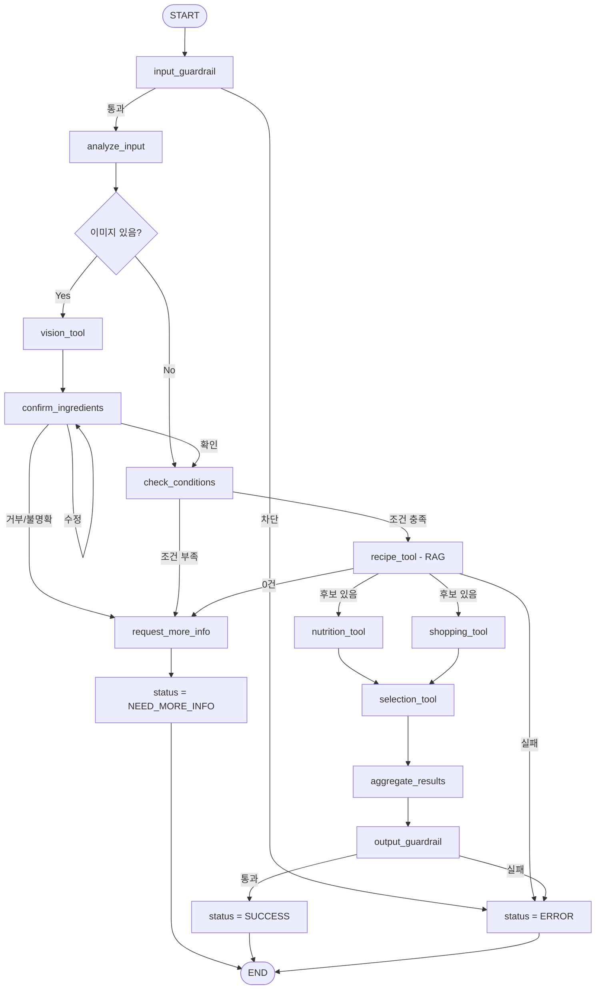

# PlanEat Agent State / Node 설계서

## 1. Agent State

PlanEat Agent는 사용자 조건, 재료 확인 상태, Tool 실행 결과를 State로 관리한다.

```python
class AgentState(TypedDict):
    session_id: str
    messages: list
    attachments: list

    ingredient_candidates: list
    confirmed_ingredients: list

    goal: str | None
    cooking_time_min: int | None

    confirmation_status: str | None
    missing_slots: list[str]

    recipe_candidates: list
    nutrition_results: dict | None
    shopping_results: dict | None
    selected_result: dict | None

    tool_errors: dict
    status: str | None
    error: str | None
```

| 필드 | 역할 |
|---|---|
| `ingredient_candidates` | Vision으로 추출한 미확정 재료 |
| `confirmed_ingredients` | 사용자 확인 또는 자연어로 입력된 확정 재료 |
| `goal` | 식단 목적 |
| `cooking_time_min` | 조리 가능 시간(분) |
| `confirmation_status` | 재료 확인 상태 |
| `missing_slots` | 부족한 필수 조건 목록 |
| `recipe_candidates` | RAG로 검색한 레시피 후보 |
| `nutrition_results` | 후보별 영양 정보 |
| `shopping_results` | 후보별 부족 재료/장보기 정보 |
| `selected_result` | Selection Tool이 선택한 최종 결과 |
| `tool_errors` | Tool별 오류 정보 |
| `status` | 현재 처리 상태 |
| `error` | 오류 발생 시 상세 정보 |

---

## 2. 주요 Node

| Node | 역할 |
|---|---|
| `input_guardrail` | 사용자 입력 안전성 검사 |
| `analyze_input` | 재료·목적·시간을 동시에 분석하고 기존 State와 병합 |
| `vision_tool` | 이미지가 있을 때 재료 후보 추출 |
| `confirm_ingredients` | Vision 재료 후보 확인 및 수정/거부 처리 |
| `check_conditions` | 필수 조건 충족 여부 확인 |
| `request_more_info` | 부족한 조건 요청 |
| `recipe_tool` | RAG 기반 레시피 후보 검색 |
| `nutrition_tool` | 후보별 영양 정보 계산 |
| `shopping_tool` | 후보별 장보기 정보 계산 |
| `selection_tool` | 후보 중 적합한 레시피·장보기 조합 선택 |
| `aggregate_results` | 선택 결과를 최종 응답 데이터로 통합 |
| `output_guardrail` | 최종 출력 안전성 검증 |

---

## 3. Node Flow



---

## 4. State 처리 규칙

### 입력 병합

`analyze_input`은 새로운 사용자 입력에서 추출한 값만 기존 State에 병합한다.

```text
기존 값 유지
+
새로 입력된 값만 갱신
```

이미지와 자연어 재료가 함께 입력되면 다음과 같이 처리한다.

```text
자연어 재료
→ confirmed_ingredients

Vision 결과
→ ingredient_candidates
→ 사용자 확인
→ confirmed_ingredients에 병합
```

### 추천 실행 조건

다음 세 조건이 모두 확보된 경우에만 Recipe 검색을 시작한다.

```text
confirmed_ingredients
+ goal
+ cooking_time_min
↓
Recipe(RAG)
```

부족한 조건은 `missing_slots`에 기록하고 한 번에 추가 질문한다.

---

## 5. Tool 실행 및 Selection

```text
Recipe 후보 검색
↓
Nutrition / Shopping 병렬 실행
↓
Selection
↓
결과 통합
```

Selection Tool은 다음 기준을 바탕으로 최종 조합을 결정한다.

1. 사용자 목적 적합도
2. 보유 재료 활용도
3. 조리 시간 충족 여부
4. 부족 재료 및 장보기 부담

Nutrition과 Shopping은 서로 다른 State key를 갱신하므로 병렬 실행 시 충돌하지 않도록 한다.

공용 오류 정보는 `tool_errors`에 저장한다.

---

## 6. 설계 원칙

1. 재료·목적·조리 시간은 `analyze_input`에서 함께 분석한다.
2. Vision Tool은 이미지가 있을 때만 호출한다.
3. Vision 결과는 확인 전까지 `ingredient_candidates`로 관리한다.
4. 이미지와 자연어 재료가 함께 있으면 확인 후 병합한다.
5. 필수 조건 확보 후 Recipe(RAG) 검색을 실행한다.
6. Recipe 결과가 0건이면 다음 Tool로 진행하지 않는다.
7. Nutrition·Shopping 결과를 기반으로 Selection Tool이 최종 조합을 결정한다.
8. Tool 실패는 `tool_errors`에 기록하고 핵심 실패 여부에 따라 종료를 결정한다.
9. Node는 하나의 책임을 가지며 분기는 Conditional Edge로 처리한다.
