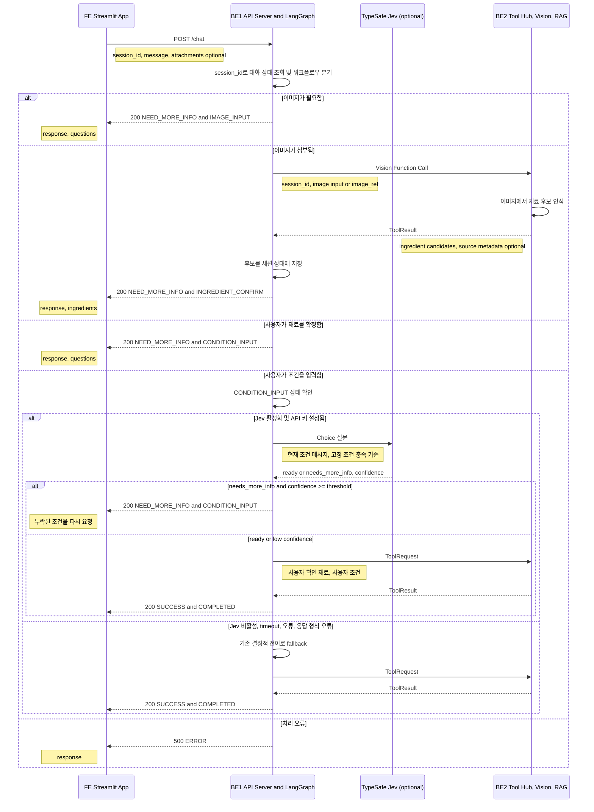
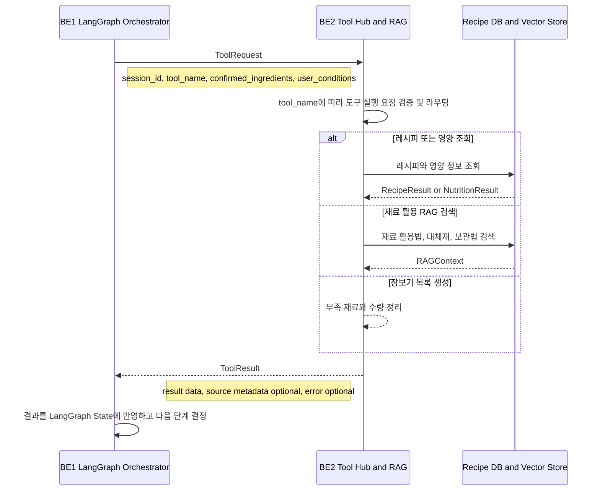
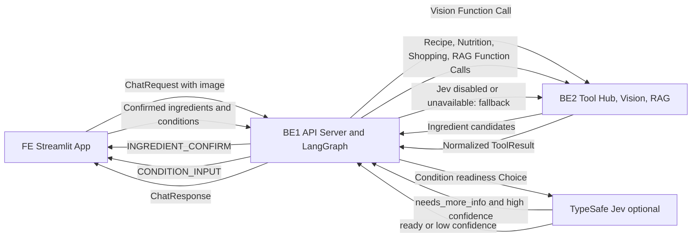

# PlanEat 데이터 흐름

## 역할과 경계

| 역할 | 담당자 | 책임 |
|---|---|---|
| FE | 이홍진 | Streamlit 화면, 사용자 입력 수집, `/chat` 응답 상태별 화면 전환 |
| BE1 | 최경락 | API Server, LangGraph Orchestrator, 세션 상태 관리, 워크플로우 분기 |
| BE2 | 박동준 | Tool Hub, RAG 검색, 도구 실행 결과 반환 |

`POST /chat`의 외부 계약은 [Chat API 명세](api/chat.md)를 따릅니다. BE1과 BE2 사이의 호출 경로와 세부 payload 형식은 아직 구현 전이므로, 아래의 BE2 인터페이스는 역할 기반의 논리적 데이터 흐름입니다.

## 1. FE → BE1 → Jev → BE2: 대화, 이미지 인식, 조건 판정

FE는 `status`와 `step`으로 화면 흐름을 결정하고, `response`, `questions`, `ingredients`, `data`는 표시 데이터로 사용합니다. `ERROR`에는 `step`이 없습니다. BE1은 이미지를 직접 인식하지 않으며, BE2의 Vision Function Call 결과를 `INGREDIENT_CONFIRM` 응답으로 변환합니다.

Jev는 선택적 결정 모델이며, `CONDITION_INPUT` 단계에서만 사용한다. `needs_more_info` 결과가
설정된 최소 confidence 이상일 때만 조건 입력을 반복한다. `ready`, API 오류, timeout, 응답 형식
오류, confidence 미달은 Chat API 오류가 아니라 기존 LangGraph 전이로 fallback되어 BE2 Tool Hub
호출을 계속 진행한다. 자세한 설정은 [Jev 연동 가이드](jev.md)를 참고한다.

## 2. BE1 → BE2: 도구 실행과 RAG 결과

### BE1 → BE2 전달 원칙

| 항목 | 용도 |
|---|---|
| `session_id` | 도구 호출을 현재 대화와 연결 |
| `tool_name` | BE1이 실행할 도구 선택 |
| `confirmed_ingredients` | 사용자 확인을 마친 재료만 전달 |
| `user_conditions` | 식단 목표·조리 시간 등 추천 조건 전달 |

### Vision Function Call 입력 계약

이미지 인식은 재료가 확정되기 전 단계이므로, 일반 추천 ToolRequest와 구분한다. BE1은 이미지가
첨부됐을 때 BE2 Vision Function Call에 `session_id`와 이미지 입력을 전달하고, BE2는 재료 후보만
반환한다. 후보는 FE의 확인 전 추천·RAG 입력으로 사용할 수 없다.

현재 BE2 endpoint와 상세 DTO는 미합의 상태다. 실제 연동 전 아래 둘 중 하나를 팀에서 확정해야 한다.

| 선택지 | 설명 |
| --- | --- |
| Vision 전용 DTO | 예: `VisionRequest = { session_id, attachments }`처럼 이미지 인식 전용 요청을 별도로 둔다. |
| ToolRequest 확장 | 기존 ToolRequest에 `attachments` 또는 안전한 `image_ref` 필드를 추가한다. |

이미지 원문을 BE1으로 전달할지, 업로드 후 생성한 안전한 참조값만 전달할지도 함께 결정한다. URL을
그대로 외부 서비스에 전달할 경우 SSRF와 접근 제어 위험이 있으므로, BE2에서 허용 형식·크기·출처를
검증하는 정책이 필요하다.

이미지 인식으로 얻은 재료 후보는 FE의 사용자 확인 전에는 BE2의 추천·검색 입력으로 사용하지 않습니다. BE2의 `ToolResult`는 BE1 내부 워크플로우용 결과이며, BE1이 이를 `/chat` 외부 응답 형태로 변환합니다.

## 흐름 요약

