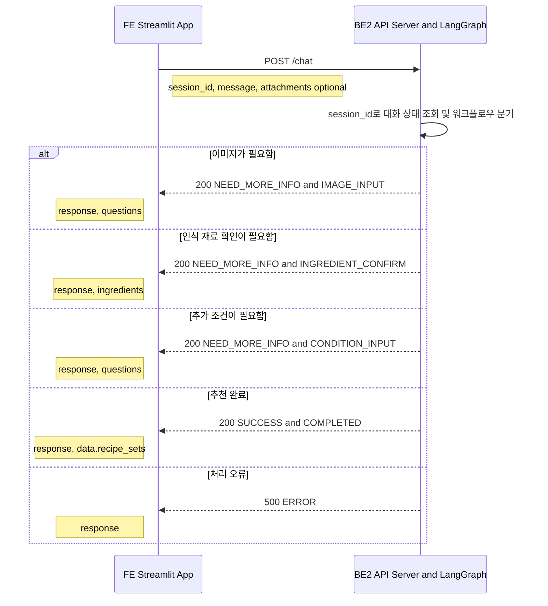
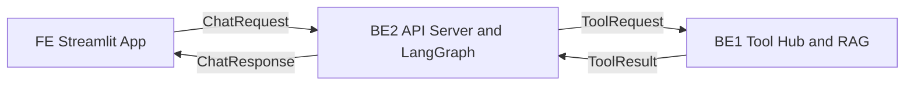

# PlanEat 데이터 흐름

## 역할과 경계

| 역할 | 담당자 | 책임 |
|---|---|---|
| FE | 이홍진 | Streamlit 화면, 사용자 입력 수집, `/chat` 응답 상태별 화면 전환 |
| BE1 | 최경락 | API Server, LangGraph Orchestrator, 세션 상태 관리, 워크플로우 분기 |
| BE2 | 박동준 | Tool Hub, RAG 검색, 도구 실행 결과 반환 |

`POST /chat`의 외부 계약은 [Chat API 명세](api/chat.md)를 따릅니다. BE2와 BE1 사이의 호출 경로와 세부 payload 형식은 아직 구현 전이므로, 아래의 BE1 인터페이스는 역할 기반의 논리적 데이터 흐름입니다.

## 1. FE → BE2: 사용자 대화 요청과 화면 응답

FE는 `status`와 `step`으로 화면 흐름을 결정하고, `response`, `questions`, `ingredients`, `data`는 표시 데이터로 사용합니다. `ERROR`에는 `step`이 없습니다.

## 2. BE2 → BE1: 도구 실행과 RAG 결과

### BE2 → BE1 전달 원칙

| 항목 | 용도 |
|---|---|
| `session_id` | 도구 호출을 현재 대화와 연결 |
| `tool_name` | BE1이 실행할 도구 선택 |
| `confirmed_ingredients` | 사용자 확인을 마친 재료만 전달 |
| `user_conditions` | 식단 목표·조리 시간 등 추천 조건 전달 |

이미지 인식으로 얻은 재료 후보는 FE의 사용자 확인 전에는 BE1의 추천·검색 입력으로 사용하지 않습니다. BE1의 `ToolResult`는 BE2 내부 워크플로우용 결과이며, BE2가 이를 `/chat` 외부 응답 형태로 변환합니다.

## 흐름 요약

